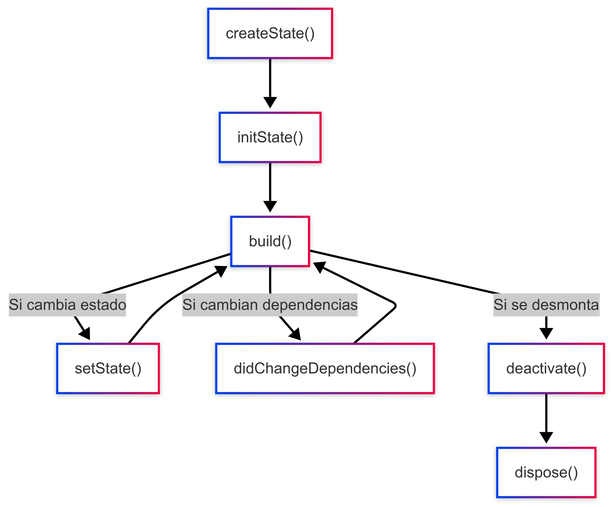

# Ciclo de Vida de Widgets en Flutter  

🚀 Entendiendo StatelessWidget y StatefulWidget  

---

## ¿Qué es Flutter? 🧑‍💻

- Framework de UI de Google
- Usa **Dart** como lenguaje
- Desarrollo rápido para móviles, web y escritorio

---

## Tipos de Widgets

1. **StatelessWidget** → No cambia después de construirse ❌
2. **StatefulWidget** → Puede cambiar durante su vida útil ✅

---

## StatelessWidget 🚀

- Son inmutables
- Se renderizan solo una vez
- **build()** es su único método clave

```dart
class MiWidget extends StatelessWidget {
  @override
  Widget build(BuildContext context) {
    return Text("Hola Flutter");
  }
}
```

---

## StatefulWidget 🔄

- Tiene un estado mutable
- Métodos clave:
  - `createState()`
  - `initState()`
  - `build()`
  - `setState()`
  - `dispose()`

---

```dart
class Contador extends StatefulWidget {
  @override
  _ContadorState createState() => _ContadorState();
}

class _ContadorState extends State<Contador> {
  int _contador = 0;

  @override
  Widget build(BuildContext context) {
    return Column(
      children: [
        Text("Contador: $_contador"),
        ElevatedButton(
          onPressed: () => setState(() => _contador++),
          child: Text("Incrementar")
        )
      ]
    );
  }
}
```

---

## **Ciclo de Vida de un StatefulWidget**



---

## Resumen 📌

✅ **StatelessWidget:** Simples y eficientes 💡
✅ **StatefulWidget:** Más dinámicos y permiten cambios 🔄
✅ **dispose():** Importante para liberar recursos ⚠️
